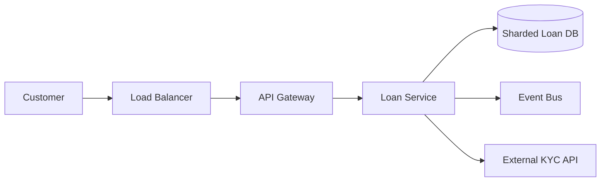

# When And Where To Place Tools In C4 Diagrams

This guide explains where to place tools or services (for example: load balancer, API gateway, sharded database, third-party services) in C4 diagrams and how to decide their level of detail.

## What C4 Means By "Tools"

C4 focuses on software systems, containers, and components. A "tool" in a business conversation usually maps to one of these:

- External system: A third-party API or SaaS (credit bureau, payment processor, CRM)
- Container: A deployable service or database within your system boundary (loan service, sharded database cluster)
- Component: An internal module inside a container (loan balance calculator, rule engine)
- Infrastructure: The hosting or runtime layer (API gateway, message broker, cache)

## Level 1: System Context

Goal: Show the system and external neighbors.

What goes here:
- Your system as a single box
- External tools or systems that interact with it

Examples:
- "Credit Bureau API" as an external system
- "Payment Processor" as an external system
- "AWS API Gateway" usually appears only if it is a public-facing system in the context view

Rule of thumb:
- Show tools only if they are outside the system boundary or key actors interact with them

## Level 2: Container Diagram

Goal: Show the major building blocks inside the system.

What goes here:
- API gateway, backend services, databases, message brokers
- Sharded database as a database container
- Loan balance service as an application container
- Load balancer as an entry container or infrastructure container

Examples:
- "Load Balancer" in front of API or web services
- "API Gateway" as entry point
- "Loan Service" as a container
- "Sharded Loan DB" as a database container
- "Event Bus" as a messaging container

Rule of thumb:
- Put a tool here if it is a deployable unit or a managed cloud service that is a core part of your architecture

## Level 3: Component Diagram

Goal: Explain the internal parts of a container.

What goes here:
- Internal modules, libraries, or subsystems
- Loan balance calculator, rules engine, risk scorer

Examples:
- "Loan Balance Calculator" as a component inside Loan Service
- "Ledger Adapter" component

Rule of thumb:
- If the tool is a library or a module and does not deploy on its own, it belongs here

## Level 4: Code Diagram

Goal: Show classes or functions.

This is optional and usually not needed in architecture decks.

## How Many Tools Should Appear

A diagram is not an inventory. It should show only the tools needed to explain the system.

Guidelines:
- 5 to 12 boxes per diagram is usually the sweet spot
- Combine minor tools into a single "Supporting Services" box
- Split into multiple diagrams when a single diagram exceeds clarity

## Decision Checklist

When choosing where to place a tool, ask:
- Is it inside or outside the system boundary
- Is it deployed independently
- Does it own data
- Is it a runtime dependency
- Does it help explain a key architectural decision

If the answer is yes, it belongs in the diagram at the right level.

## Example Placement

- Load balancer: Container (entry) or infrastructure
- AWS API Gateway: Container (entry point) or external system depending on scope
- Sharded database: Container (database) and annotate sharding strategy
- Loan balance engine: Component inside Loan Service unless it is a separate service
- Third-party KYC service: External system in context diagram

## Mermaid Example (Container View)

