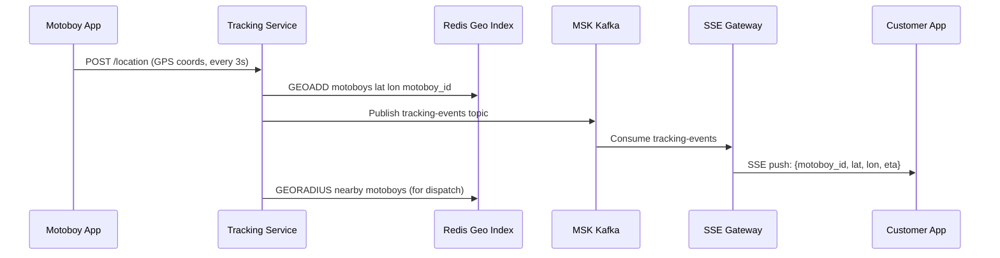
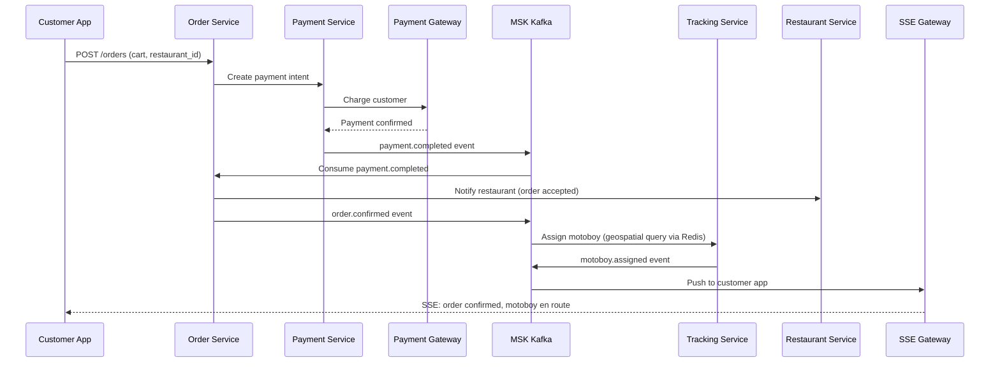

# Food Delivery Platform - Solution Architecture

## Context and Requirements

- **Traffic**: 100,000 requests per minute (~1,667 req/s peak, higher during meal rushes)
- **Client**: Mobile app (iOS and Android)
- **Key features**:
  - Real-time motoboy location tracking via SSE
  - Order purchase and payment processing
  - User registration and authentication
  - Restaurant catalog and menu management
  - Order lifecycle management
  - Payment gateway integration
  - Push notifications

## Architecture Decision Summary

| Decision | Choice | Rationale |
| --- | --- | --- |
| Compute | EKS with managed node groups + Karpenter | Microservice count justifies Kubernetes; autoscaling handles traffic spikes |
| Edge | Route 53 + CloudFront + ALB + WAF | Global DNS, CDN for static assets, load distribution, edge protection |
| API entry | API Gateway (REST) + separate SSE endpoint | REST for CRUD, dedicated SSE path for motoboy tracking |
| Data | Sharded PostgreSQL (orders/users) + DynamoDB (sessions/tracking) | Sharding for horizontal scale on high-write tables; DynamoDB for low-latency key access |
| Cache | ElastiCache Redis (cluster mode) | Session cache, restaurant catalog cache, geospatial queries for motoboy proximity |
| Async | MSK Kafka + SQS | Kafka for event streaming (order events, tracking updates); SQS for payment retries |
| Observability | CloudWatch + X-Ray + Prometheus/Grafana | Native AWS monitoring plus distributed tracing for microservice latency |
| CI/CD | GitHub Actions + Argo CD + Terraform | GitOps for EKS deployments; IaC for all AWS resources |

## Solution Architecture Diagram

```mermaid
flowchart TD
    subgraph Clients["Mobile Clients"]
        iOS[iOS App]
        Android[Android App]
    end

    subgraph Edge["Layer 1: Edge and Entry"]
        Route53[Route 53]
        CloudFront[CloudFront CDN]
        WAF[WAF]
        ALB[Application Load Balancer]
        ALBSSE[ALB - SSE Endpoint]
    end

    subgraph VPC["VPC"]
        subgraph PublicSubnet[Public Subnets]
            ALB
            ALBSSE
            NATGW[NAT Gateway]
        end

        subgraph PrivateSubnet[Private Subnets]
            subgraph Compute["Layer 3: Compute - EKS Cluster"]
                UserSvc[User Registry Service]
                AuthSvc[Auth Service]
                RestaurantSvc[Restaurant Catalog Service]
                OrderSvc[Order Service]
                PaymentSvc[Payment Service]
                TrackingSvc[Tracking Service]
                SSEGateway[SSE Gateway Service]
                NotifySvc[Notification Service]
            end

            subgraph Data["Layer 4: Data"]
                RedisCluster[ElastiCache Redis Cluster]
                ShardedPostgres[(Sharded PostgreSQL)]
                ShardedPostgresUsers[(User Shard DB)]
                ShardedPostgresOrders[(Order Shard DB)]
                DynamoTracking[(DynamoDB - Live Tracking)]
                DynamoSessions[(DynamoDB - Sessions)]
                S3Assets[S3 - Images/Assets]
            end

            subgraph Integration["Layer 5: Integration"]
                MSKCluster[MSK Kafka Cluster]
                SQSPayment[SQS - Payment Retry Queue]
                SQSNotify[SQS - Notification Queue]
            end

            subgraph External["External Services"]
                PaymentGateway[Payment Gateway API]
                PushService[FCM / APNs]
                MapsAPI[Google Maps / Mapbox API]
            end
        end

        subgraph Endpoints[VPC Endpoints]
            VPCE[S3 / DynamoDB PrivateLink]
        end
    end

    subgraph Security["Layer 6: Security"]
        IAM[IAM Roles / IRSA]
        Secrets[Secrets Manager]
    end

    subgraph Observability["Layer 7: Observability"]
        CloudWatchSvc[CloudWatch]
        XRay[X-Ray Tracing]
        Prometheus[Prometheus / Grafana]
    end

    subgraph CICD["Layer 8: CI/CD"]
        GitHub[GitHub Actions]
        ArgoCD[Argo CD]
        Terraform[Terraform]
    end

    %% Client to Edge
    iOS --> Route53
    Android --> Route53
    Route53 --> CloudFront
    CloudFront --> WAF
    WAF --> ALB
    WAF --> ALBSSE

    %% ALB to API Gateway to services
    ALB --> UserSvc
    ALB --> AuthSvc
    ALB --> RestaurantSvc
    ALB --> OrderSvc
    ALB --> PaymentSvc
    ALB --> TrackingSvc

    %% SSE path
    ALBSSE --> SSEGateway

    %% Service to data
    UserSvc --> ShardedPostgresUsers
    UserSvc --> RedisCluster
    AuthSvc --> DynamoSessions
    AuthSvc --> RedisCluster
    RestaurantSvc --> RedisCluster
    RestaurantSvc --> S3Assets
    OrderSvc --> ShardedPostgresOrders
    OrderSvc --> RedisCluster
    PaymentSvc --> SQSPayment
    TrackingSvc --> DynamoTracking
    TrackingSvc --> RedisCluster
    SSEGateway --> RedisCluster
    SSEGateway --> MSKCluster
    NotifySvc --> SQSNotify

    %% Kafka event streaming
    OrderSvc -.->|order.created / order.updated| MSKCluster
    PaymentSvc -.->|payment.completed / payment.failed| MSKCluster
    TrackingSvc -.->|motoboy.location.update| MSKCluster
    MSKCluster -.-> NotifySvc
    MSKCluster -.-> SSEGateway

    %% SQS consumers
    SQSPayment --> PaymentSvc
    SQSNotify --> NotifySvc

    %% External integrations
    PaymentSvc --> PaymentGateway
    NotifySvc --> PushService
    TrackingSvc --> MapsAPI

    %% Security cross-cutting
    UserSvc -.-> IAM
    UserSvc -.-> Secrets
    OrderSvc -.-> IAM
    OrderSvc -.-> Secrets
    PaymentSvc -.-> IAM
    PaymentSvc -.-> Secrets

    %% Observability cross-cutting
    UserSvc -.-> CloudWatchSvc
    OrderSvc -.-> CloudWatchSvc
    PaymentSvc -.-> CloudWatchSvc
    TrackingSvc -.-> XRay
    SSEGateway -.-> XRay

    %% CI/CD
    GitHub --> ArgoCD
    ArgoCD --> Compute
    Terraform --> VPC
    Terraform --> ShardedPostgres
    Terraform --> RedisCluster
    Terraform --> MSKCluster
```

## Component Details

### Layer 1: Edge and Entry

| Component | Purpose | Scale Notes |
| --- | --- | --- |
| Route 53 | DNS with latency-based routing and health checks | Multi-region failover ready |
| CloudFront | CDN for app assets, restaurant images, menus | Cached static content, reduces origin load |
| WAF | Rate limiting, bot protection, SQLi/XSS rules | 100k req/min requires tuned rate rules |
| ALB (REST) | Distributes REST API traffic across EKS pods | Path-based routing to services |
| ALB (SSE) | Dedicated ALB for SSE connections | Long-lived connections, separate autoscaling |

### Layer 3: Compute - EKS Services

| Service | Responsibility | Replicas (baseline) |
| --- | --- | --- |
| User Registry Service | User CRUD, profile management, preferences | 4-8 pods |
| Auth Service | JWT issuance, token validation, OAuth/social login | 4-8 pods |
| Restaurant Catalog Service | Restaurant list, menus, availability, pricing | 6-12 pods |
| Order Service | Order creation, state machine, lifecycle management | 8-16 pods |
| Payment Service | Payment intent creation, gateway calls, reconciliation | 4-8 pods |
| Tracking Service | Motoboy location ingestion, geospatial queries | 6-12 pods |
| SSE Gateway Service | SSE connections to mobile clients, location push | 8-16 pods |
| Notification Service | Push notifications, email, SMS | 2-4 pods |

### Layer 4: Data

| Store | Purpose | Sharding Strategy |
| --- | --- | --- |
| Sharded PostgreSQL - Users | User accounts, profiles, addresses | Shard by user_id hash (8 shards) |
| Sharded PostgreSQL - Orders | Orders, items, status history | Shard by order_id hash (16 shards) |
| ElastiCache Redis Cluster | Session cache, restaurant catalog, geospatial motoboy index | 6-node cluster (3 primary + 3 replica) |
| DynamoDB - Live Tracking | Real-time motoboy location (high write, TTL expiry) | Single table with partition key: motoboy_id |
| DynamoDB - Sessions | Active user sessions and tokens | Single table with partition key: session_id |
| S3 | Restaurant images, logos, menu photos | Versioning enabled, CloudFront origin |

### Layer 5: Integration

| Component | Purpose | Throughput |
| --- | --- | --- |
| MSK Kafka - order-events | Order state transitions, fan-out to tracking and notifications | 10k events/min |
| MSK Kafka - payment-events | Payment confirmations, failures, retries | 5k events/min |
| MSK Kafka - tracking-events | Motoboy location streams, SSE fan-out | 50k events/min |
| SQS - Payment Retry | Dead-letter and retry for failed payment gateway calls | 1k msg/min |
| SQS - Notification | Async push/email/SMS dispatch | 5k msg/min |

### SSE Motoboy Tracking Flow

### Order Lifecycle Flow

## Scaling Strategy

### Horizontal Scaling per Service

| Service | Min Pods | Max Pods | Scale Trigger | HPA Metric |
| --- | --- | --- | --- | --- |
| User Registry | 4 | 20 | CPU > 70% | CPU utilization |
| Auth | 4 | 20 | CPU > 70% | CPU utilization |
| Restaurant Catalog | 6 | 30 | CPU > 65% + cache miss rate | CPU + Redis cache miss |
| Order Service | 8 | 40 | CPU > 60% + queue depth | CPU + Kafka lag |
| Payment Service | 4 | 16 | CPU > 65% + SQS depth | CPU + SQS visible count |
| Tracking Service | 6 | 30 | CPU > 60% + write latency | CPU + DynamoDB latency |
| SSE Gateway | 8 | 50 | Active connections > 5000 per pod | Connection count |
| Notification Service | 2 | 10 | SQS depth | SQS visible count |

### Database Scaling

| Store | Strategy | Details |
| --- | --- | --- |
| Sharded PostgreSQL | 8-16 shards, each on r6g.2xlarge | Read replicas per shard for read-heavy queries |
| ElastiCache Redis | 6-node cluster mode, 3 primaries | Automatic failover, multi-AZ |
| DynamoDB | On-demand mode | Auto-scales to handle burst tracking writes |

## Security Design

- **IAM Roles for Service Accounts (IRSA)**: Each EKS pod gets least-privilege IAM role
- **Secrets Manager**: Database credentials, payment gateway API keys, OAuth secrets
- **WAF Rules**: Rate limiting at 200 req/min per IP, bot control, known bad IP blocks
- **VPC Isolation**: All services in private subnets, no public IPs on pods
- **TLS Everywhere**: ALB terminates TLS, internal service mesh with mTLS optional
- **Data Encryption**: RDS encryption at rest, DynamoDB server-side encryption, S3 SSE-S3

## Cost Optimization Notes

- **Karpenter** for node autoscaling instead of static managed node groups
- **Spot instances** for stateless services (catalog, notifications, SSE gateway replicas)
- **Reserved instances** for baseline database and Redis capacity
- **CloudFront** reduces origin egress costs for static assets
- **DynamoDB on-demand** for tracking table avoids over-provisioning for variable load
