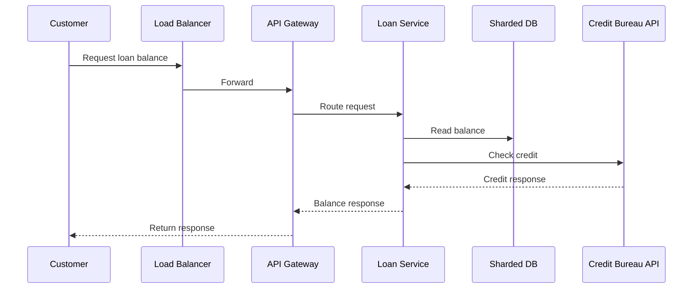

# When And Where To Place Tools In Sequence Or Flow Diagrams

This guide explains where to place tools or services in sequence or flow diagrams that show request paths, plus when to include them.

## What Sequence Diagrams Are For

Goal: show step-by-step interactions between systems.

This is where you show:
- Ordering
- Dependencies
- Failure and retry paths

## Which Tools To Include

Include any tool that participates in the flow.

Examples:
- Load balancer
- API Gateway
- Loan Service
- Sharded database
- Credit bureau API
- Message queue

## How Much Detail

Sequence diagrams can have more elements than C4 diagrams, but keep them readable.

Guidelines:
- 6 to 12 participants for a single sequence
- Split into separate diagrams for happy path and error path
- Use notes for timeouts, retries, and circuit breakers

## Example Flow

1. Client calls Load Balancer
2. Load Balancer forwards to API Gateway
3. API Gateway forwards to Loan Service
4. Loan Service checks cache
5. Loan Service reads sharded DB
6. Loan Service calls Credit Bureau API
7. Loan Service returns response

## Mermaid Example (Sequence)

