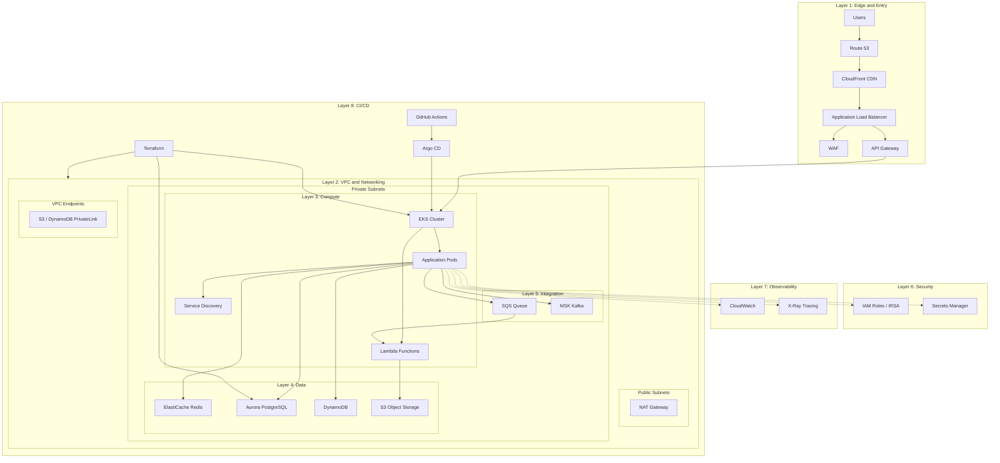

# When And Where To Place Tools In Solution Architecture Diagrams

This guide explains where to place tools or services in solution architecture diagrams (cloud services and infrastructure), plus why they exist.

## What Belongs In A Solution Architecture Diagram

Goal: show the major runtime services, data flows, and boundaries.

Typical elements:
- Public entry points (DNS, CDN, load balancer, API gateway)
- Compute (containers, serverless, VMs)
- Data stores (relational, NoSQL, sharded clusters)
- Integration (queues, event buses, ETL)
- External systems (credit bureau, payment gateways)
- Networking boundaries (VPCs, subnets, NAT gateways)
- CI/CD pipelines and deployment automation
- Security and compliance boundaries

## Where To Place Common Tools

- Load balancer: edge entry, in front of services
- AWS API Gateway: edge entry, in front of APIs
- Loan balance service: core compute layer
- Sharded database: data layer with shard boundaries
- Cache (Redis): between compute and data layers
- Messaging (Kafka/SNS/SQS): integration layer

## How Many Tools To Show

Focus on clarity, not completeness.

Guidelines:
- 8 to 15 major services per diagram is typically readable
- Group minor tools into shared boxes ("Shared Services")
- Use callouts for key choices (sharding, consistency, failover)

## Why And How To Choose

Include a tool if:
- It is a runtime dependency
- It owns critical data
- It is a critical scalability or reliability choice
- It is a security boundary

Exclude or collapse tools if:
- It is a utility without architecture impact
- It is an internal library
- It clutters the diagram without changing decisions

## Architectural Layers

Tools are organized below by the layer they typically occupy in a solution architecture diagram:

1. Edge and Entry
2. Networking Boundaries
3. Compute and Orchestration
4. Data and Storage
5. Integration and Messaging
6. Security and Secrets
7. Observability
8. CI/CD and Deployment

Each section covers a generic pattern first, then its managed service equivalents.

---

## Layer 1: Edge and Entry

### Route 53 (DNS)

What it is:
- Managed DNS that maps domains to endpoints (load balancers, CloudFront, APIs).

When to use:
- You host public or private domains.
- You need health checks and DNS-based failover.

Why use it:
- Reliable global DNS with health-aware routing.

Problem it solves:
- Unreliable DNS, manual routing, and slow failovers.

### CloudFront (CDN)

What it is:
- Content Delivery Network that caches and serves content from edge locations.

When to use:
- You serve static assets or APIs to users in many regions.
- You want lower latency and DDoS protection at the edge.

Why use it:
- Faster responses and reduced origin load.

Problem it solves:
- High latency and origin overload for global traffic.

### Load Balancer

What it is:
- A network service that distributes incoming traffic across multiple servers or instances.

When to use:
- You have more than one instance of a service.
- You need high availability or zero-downtime deploys.
- You want to absorb traffic spikes.

Why use it:
- Prevents a single server from being a bottleneck.
- Allows rolling deployments and failover.
- Improves reliability and performance.

Problem it solves:
- Single point of failure and uneven traffic distribution.

### API Gateway

What it is:
- A managed entry point for APIs that handles routing, auth, throttling, and monitoring.

When to use:
- Multiple backend services need a single entry.
- You need consistent auth, rate limiting, or request validation.
- You need to expose APIs to external clients.

Why use it:
- Centralizes cross-cutting concerns.
- Simplifies client integration.

Problem it solves:
- Duplicate gateway logic in every service and inconsistent security.

---

## Layer 2: Networking Boundaries

### VPC and Subnets

What it is:
- A logically isolated virtual network in the cloud, divided into public and private subnets.

When to use:
- You need to isolate workloads from the public internet.
- You want to control traffic flow with route tables, NAT gateways, and security groups.

Why use it:
- Network segmentation and least-privilege access between tiers.

Problem it solves:
- Flat networks with no boundaries between public-facing and internal resources.

### NAT Gateway

What it is:
- Allows resources in private subnets to make outbound internet connections without inbound exposure.

When to use:
- Private instances need to download packages, call external APIs, or reach public endpoints.

Why use it:
- Enables outbound connectivity while blocking inbound traffic from the internet.

Problem it solves:
- Private workloads that need internet access without public IPs.

### VPC Endpoints (PrivateLink)

What it is:
- Private connections between your VPC and AWS services without traversing the public internet.

When to use:
- You access S3, DynamoDB, or other AWS services from private subnets.
- Compliance requires all traffic to stay within the AWS network.

Why use it:
- Reduces data transfer costs and eliminates public internet exposure.

Problem it solves:
- Private workloads forced through NAT gateways or public IPs to reach cloud services.

---

## Layer 3: Compute and Orchestration

### Containers and Orchestration (EKS)

What it is:
- Managed Kubernetes for running containerized services.

When to use:
- You need container orchestration, autoscaling, and service discovery.
- You run many microservices.
- You need portability across clouds or on-premises environments.

Why use it:
- Standardized deployment and scaling across services.

Problem it solves:
- Manual container management and inconsistent deployments.

### Serverless (Lambda, Fargate)

What it is:
- Compute that runs code without managing servers, scaling automatically per request.

When to use:
- Event-driven workloads, background processing, or intermittent traffic.
- You want to minimize operational overhead.

Why use it:
- Pay-per-use pricing with no capacity planning.

Problem it solves:
- Idle server costs and manual scaling for spiky workloads.

### Virtual Machines (EC2)

What it is:
- Traditional virtual machines with full control over OS, runtime, and installed software.

When to use:
- The workload is not containerized or cannot be containerized cleanly.
- You need full host-level control over kernel settings, agents, or licensing.

Why use it:
- Maximum infrastructure control for legacy or specialized workloads.

Problem it solves:
- Workloads that do not fit container or serverless models.

### Service Discovery

What it is:
- A registry of active service instances.

When to use:
- Many dynamic services or containers.
- Autoscaling with frequent instance changes.

Why use it:
- Enables routing without hardcoding endpoints.

Problem it solves:
- Manual configuration and stale endpoints.

---

## Layer 4: Data and Storage

### Relational Database (RDS, Aurora)

What it is:
- The system of record for persistent data with strong consistency and complex query support.

When to use:
- You need ACID transactions, joins, or complex queries.
- You need durable storage with strong data integrity.

Why use it:
- Ensures data durability, integrity, and relational querying.

Problem it solves:
- Data loss and inconsistent state.

### Sharded Database

What it is:
- A database split across multiple nodes by a shard key.

When to use:
- Data size or traffic exceeds single database limits.
- You need horizontal scale beyond a single instance.

Why use it:
- Allows growth by adding nodes.

Problem it solves:
- Storage and performance limits of a single database.

### NoSQL (DynamoDB, DocumentDB)

What it is:
- Managed NoSQL key-value and document database for massive scale and flexible schema.

When to use:
- You need massive scale, low latency, and flexible schema.
- Access patterns are simple and predictable by keys.

Why use it:
- Automatic scaling and high availability without managing servers.

Problem it solves:
- Scaling relational databases for simple key-based workloads.

### Cache (Redis, ElastiCache, Memcached)

What it is:
- An in-memory store for fast reads, available as self-managed or fully managed service.

When to use:
- Repeated reads of the same data.
- Expensive queries or computations.
- Need to reduce database load.

Why use it:
- Improves latency and throughput.

Problem it solves:
- Slow reads and database overload.

### Object Storage (S3)

What it is:
- Durable, scalable storage for files, backups, logs, and static assets.

When to use:
- You store unstructured data, artifacts, or large files.
- You need long-term retention with lifecycle policies.

Why use it:
- Nearly unlimited storage with built-in replication and versioning.

Problem it solves:
- File storage that outgrows local disks or requires high durability.

---

## Layer 5: Integration and Messaging

### Message Queue or Event Bus (SQS, SNS, EventBridge)

What it is:
- A system that moves work asynchronously or broadcasts events between services.

When to use:
- Work can be done later or in parallel.
- You need reliable retries.
- You need to decouple producers from consumers.

Why use it:
- Smooths traffic spikes and increases resilience.

Problem it solves:
- Tight coupling and cascading failures during traffic spikes.

### Event Streaming (MSK / Kafka)

What it is:
- Managed Apache Kafka service for high-throughput event streaming.

When to use:
- You need durable, ordered streams with many producers and consumers.
- You want Kafka without managing brokers.

Why use it:
- Reliable event pipelines with less operational overhead.

Problem it solves:
- Running and scaling Kafka yourself.

### ETL and Data Pipelines (Glue, Step Functions)

What it is:
- Services that transform, move, and orchestrate data between systems.

When to use:
- You need to batch process, transform, or sync data across stores.
- You need visual or code-based workflow orchestration.

Why use it:
- Centralized data transformation with scheduling and error handling.

Problem it solves:
- Ad-hoc scripts and fragile manual data syncs.

---

## Layer 6: Security and Secrets

### Secrets Manager

What it is:
- Secure storage for credentials and keys with rotation and auditing.

When to use:
- You store API keys or database passwords.
- You need rotation and auditing.

Why use it:
- Prevents secrets leakage.

Problem it solves:
- Hardcoded secrets and weak access control.

### IAM and Role-Based Access

What it is:
- Identity and access management for users, services, and resources.

When to use:
- Every workload needs least-privilege access controls.
- You need to enforce who can do what across your environment.

Why use it:
- Centralized authorization and audit trail for all access.

Problem it solves:
- Shared credentials, over-permissive access, and lack of accountability.

### Web Application Firewall (WAF)

What it is:
- A firewall that protects web applications from common exploits (SQL injection, XSS, bots).

When to use:
- You expose APIs or web applications to the internet.
- You need to block malicious traffic patterns.

Why use it:
- Protects applications without modifying application code.

Problem it solves:
- Common web attacks and automated threats at the edge.

---

## Layer 7: Observability

### Observability Stack (CloudWatch, Prometheus, Grafana, OpenTelemetry)

What it is:
- Logs, metrics, and traces with alerting, available as managed or self-managed solutions.

When to use:
- You need to troubleshoot production issues.
- You need uptime and performance visibility.

Why use it:
- Shortens incident response times.

Problem it solves:
- Blind spots in production systems.

### CloudWatch

What it is:
- AWS monitoring service for metrics, logs, alarms, and dashboards.

When to use:
- You run workloads on AWS and need native observability.

Why use it:
- Centralized monitoring and alerting for AWS resources.

Problem it solves:
- Fragmented monitoring and slow incident response.

### Distributed Tracing (X-Ray, Jaeger)

What it is:
- Tracks requests as they flow through multiple services in a distributed system.

When to use:
- You have many microservices and need to identify latency bottlenecks.
- You need to understand end-to-end request paths.

Why use it:
- Visibility across service boundaries that logs alone cannot provide.

Problem it solves:
- "It is slow somewhere but we do not know where."

---

## Layer 8: CI/CD and Deployment

### CI/CD Pipeline (CodePipeline, GitHub Actions, GitLab CI)

What it is:
- Automated build, test, and deployment pipeline triggered by code changes.

When to use:
- You want repeatable, auditable deployments.
- You need to gate releases with automated tests and approvals.

Why use it:
- Reduces human error and accelerates delivery.

Problem it solves:
- Manual deployments and inconsistent release processes.

### GitOps (Argo CD, Flux)

What it is:
- Git as the single source of truth for infrastructure and application state, with controllers that sync the cluster to the desired state.

When to use:
- You manage Kubernetes or declarative infrastructure.
- You want auditability, rollback, and drift detection.

Why use it:
- Declarative, version-controlled deployments with automatic reconciliation.

Problem it solves:
- Configuration drift and opaque manual cluster changes.

### Infrastructure as Code (Terraform, CloudFormation, CDK)

What it is:
- Declarative or programmatic definitions of cloud resources that can be versioned and applied repeatedly.

When to use:
- You manage more than a handful of cloud resources.
- You need reproducible environments (dev, staging, prod).

Why use it:
- Consistent, auditable infrastructure that can be reviewed and rolled back.

Problem it solves:
- Manual cloud console changes, environment drift, and unreproducible setups.

---

## Example Solution Architecture

The following diagram shows a typical multi-tier application with tool placement across all layers:

Placement summary for this example:

| Layer | Tool | Placement |
| --- | --- | --- |
| Edge | Route 53, CloudFront, ALB, WAF, API Gateway | Internet-facing entry tier |
| Networking | VPC, public/private subnets, NAT Gateway, VPC Endpoints | Network boundary and traffic routing |
| Compute | EKS, Lambda, Service Discovery | Private subnet workload tier |
| Data | ElastiCache, Aurora, DynamoDB, S3 | Private subnet data tier |
| Integration | SQS, MSK | Async and event streaming tier |
| Security | IAM, Secrets Manager | Cross-cutting access control |
| Observability | CloudWatch, X-Ray | Cross-cutting monitoring |
| CI/CD | GitHub Actions, Argo CD, Terraform | External pipeline and IaC |
