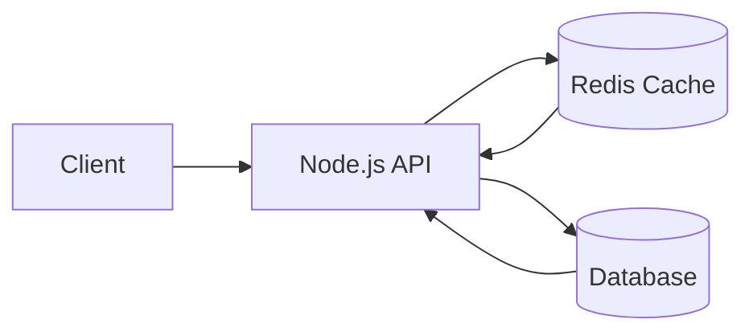

# Simple Redis Cache



This demo implements a small cache-aside pattern:

- The API checks Redis first.
- On a cache miss, it reads from a simulated database.
- The database result is stored in Redis with a TTL.
- Later reads for the same key return from cache until the TTL expires.

## Run Redis

```powershell
docker run --rm --name arch-redis -p 6379:6379 redis:7-alpine
```

## Run The Demo

In another terminal:

```powershell
node .\solution-architecture\cache\redis-cache.js
```

## Try It

First request reads from the simulated database and caches the result:

```powershell
Invoke-RestMethod http://localhost:7070/users/1
```

Second request reads from Redis:

```powershell
Invoke-RestMethod http://localhost:7070/users/1
```

Set a custom cache entry:

```powershell
Invoke-RestMethod `
  -Method Put `
  -ContentType "application/json" `
  -Body '{"value":{"enabled":true},"ttlSeconds":60}' `
  http://localhost:7070/cache/features:checkout
```

Read a custom cache entry:

```powershell
Invoke-RestMethod http://localhost:7070/cache/features%3Acheckout
```

Delete a custom cache entry:

```powershell
Invoke-RestMethod -Method Delete http://localhost:7070/cache/features%3Acheckout
```

## Environment Variables

- `PORT`: API port. Default: `7070`.
- `REDIS_HOST`: Redis host. Default: `127.0.0.1`.
- `REDIS_PORT`: Redis port. Default: `6379`.
- `CACHE_TTL_SECONDS`: Cache TTL. Default: `30`.
