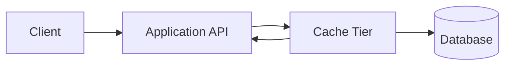
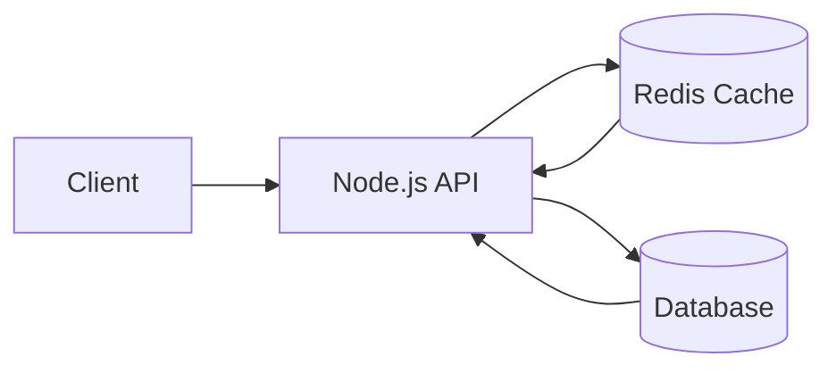

# Cache Tier



This folder has two JavaScript cache demos:

- `cache-tier.js`: a self-contained Node.js cache tier using an in-memory `Map`.
- `redis-cache.js`: a cache-aside API that stores cached values in Redis.

The cache tier demonstrates:

- Fast reads from the cache when an item is hot.
- Slower reads from a simulated database on cache misses.
- TTL-based expiration.
- Cache invalidation after writes.
- Hit, miss, write, invalidation, and hit-ratio stats.

## Run The Self-Contained Demo

```powershell
node .\solution-architecture\cache\cache-tier.js
```

## Try It

First request reads from the simulated database and fills the cache:

```powershell
Invoke-RestMethod http://localhost:7071/products/sku-100
```

Second request reads from the cache:

```powershell
Invoke-RestMethod http://localhost:7071/products/sku-100
```

Inspect cache entries and stats:

```powershell
Invoke-RestMethod http://localhost:7071/cache
```

Update the product. This writes to the simulated database and invalidates the cached product:

```powershell
Invoke-RestMethod `
  -Method Put `
  -ContentType "application/json" `
  -Body '{"price":29.9,"stock":35}' `
  http://localhost:7071/products/sku-100
```

Delete one cached key:

```powershell
Invoke-RestMethod -Method Delete http://localhost:7071/cache/products%3Asku-100
```

Clear all cached entries:

```powershell
Invoke-RestMethod -Method Delete http://localhost:7071/cache
```

## Self-Contained Demo Environment Variables

- `PORT`: API port. Default: `7071`.
- `CACHE_TTL_SECONDS`: Cache TTL. Default: `20`.

---

# Simple Redis Cache



The Redis demo implements a small cache-aside pattern:

- The API checks Redis first.
- On a cache miss, it reads from a simulated database.
- The database result is stored in Redis with a TTL.
- Later reads for the same key return from cache until the TTL expires.

## Run Redis

```powershell
docker run --rm --name arch-redis -p 6379:6379 redis:7-alpine
```

## Run The Demo

In another terminal:

```powershell
node .\solution-architecture\cache\redis-cache.js
```

## Try It

First request reads from the simulated database and caches the result:

```powershell
Invoke-RestMethod http://localhost:7070/users/1
```

Second request reads from Redis:

```powershell
Invoke-RestMethod http://localhost:7070/users/1
```

Set a custom cache entry:

```powershell
Invoke-RestMethod `
  -Method Put `
  -ContentType "application/json" `
  -Body '{"value":{"enabled":true},"ttlSeconds":60}' `
  http://localhost:7070/cache/features:checkout
```

Read a custom cache entry:

```powershell
Invoke-RestMethod http://localhost:7070/cache/features%3Acheckout
```

Delete a custom cache entry:

```powershell
Invoke-RestMethod -Method Delete http://localhost:7070/cache/features%3Acheckout
```

## Environment Variables

- `PORT`: API port. Default: `7070`.
- `REDIS_HOST`: Redis host. Default: `127.0.0.1`.
- `REDIS_PORT`: Redis port. Default: `6379`.
- `CACHE_TTL_SECONDS`: Cache TTL. Default: `30`.
