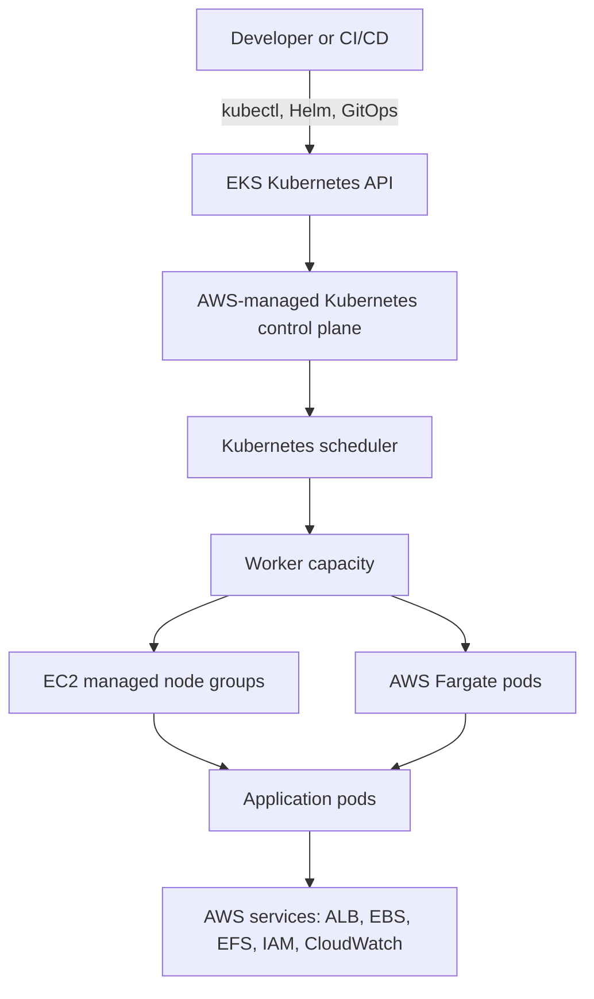
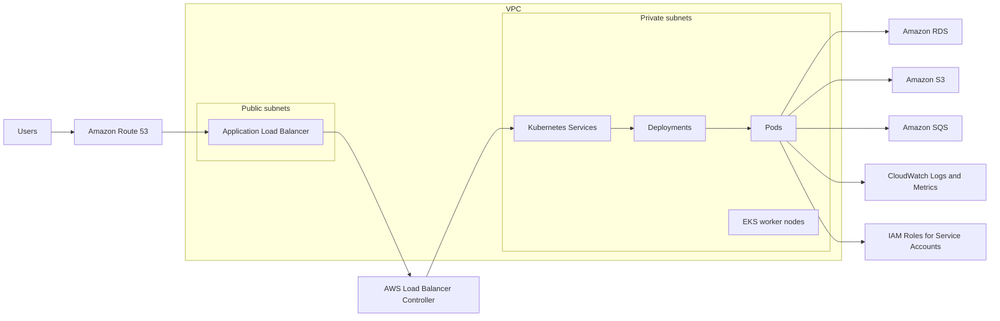
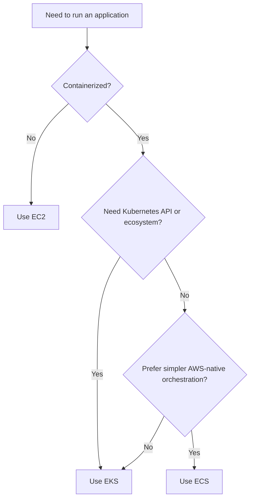
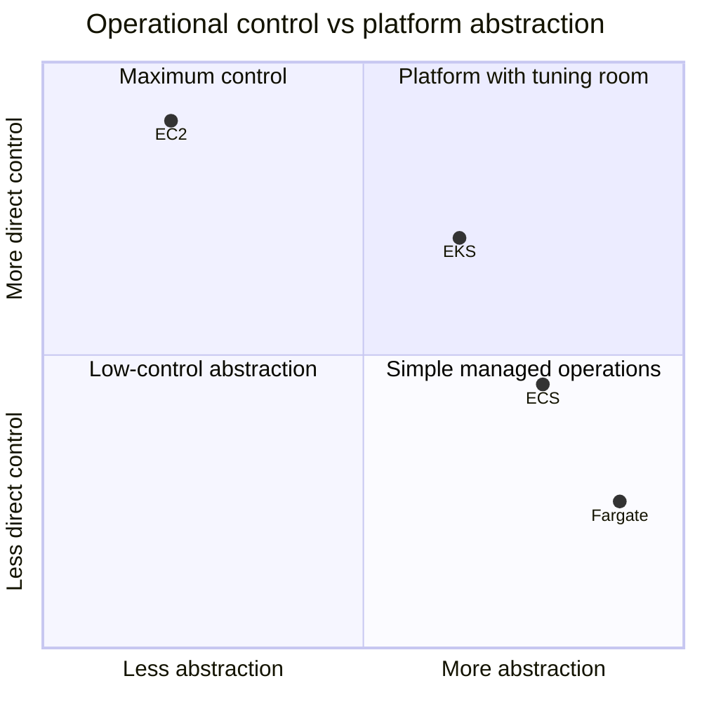

# Amazon EKS

Amazon Elastic Kubernetes Service (EKS) is AWS's managed Kubernetes service. It runs the Kubernetes control plane for you, integrates it with AWS identity, networking, load balancing, observability, and storage services, and lets your teams run containerized applications using the Kubernetes API.

With EKS, you still design and operate the worker capacity where workloads run. That capacity can be EC2 managed node groups, self-managed EC2 nodes, Fargate profiles, or a hybrid pattern. AWS manages the availability and lifecycle of the Kubernetes control plane, while platform and application teams manage cluster configuration, add-ons, deployments, security boundaries, and day-to-day operations.

## Where EKS Fits

EKS is a good fit when you want Kubernetes as the operating model: portable manifests, rich scheduling, service mesh options, advanced deployment strategies, open-source controllers, and a common platform across teams or clouds. It is especially useful when the organization already has Kubernetes skills or wants to standardize around Kubernetes APIs.

## Typical EKS Architecture

Common production building blocks include:

- Private worker nodes across multiple Availability Zones.
- Managed node groups or Karpenter for autoscaling EC2 capacity.
- Fargate for isolated or low-operations pod execution.
- AWS Load Balancer Controller for ALB/NLB provisioning.
- IAM Roles for Service Accounts (IRSA) or EKS Pod Identity for least-privilege AWS access.
- EBS CSI, EFS CSI, or S3 integrations depending on storage needs.
- GitOps with Argo CD, Flux, or a CI/CD pipeline that applies Kubernetes manifests.
- Observability through CloudWatch, Prometheus, Grafana, OpenTelemetry, or a third-party platform.

## EKS vs ECS vs EC2

| Option | Best for | Strengths | Tradeoffs |
| --- | --- | --- | --- |
| EKS | Teams that need Kubernetes, portability, complex orchestration, or a platform layer shared by many teams. | Kubernetes ecosystem, flexible scheduling, strong extensibility, multi-cloud patterns, mature GitOps and service mesh options. | Higher operational complexity, Kubernetes learning curve, cluster add-on management, more decisions around networking, upgrades, and security. |
| ECS | Teams that want to run containers on AWS with less orchestration overhead. | Simple AWS-native container service, strong IAM and ALB integration, no Kubernetes control plane to manage, good fit with Fargate. | Less portable than Kubernetes, smaller open-source ecosystem, fewer advanced scheduling and platform extension patterns. |
| EC2 | Workloads that need direct VM control, legacy deployment models, custom agents, or non-containerized software. | Maximum infrastructure control, familiar VM model, supports almost any runtime or operating pattern. | You manage more: patching, deployment orchestration, scaling behavior, service discovery, process supervision, and host security. |

## Decision Tradeoffs

### Choose EKS when

- Kubernetes is already part of the organization's platform strategy.
- You need portability across AWS, other clouds, or on-premises environments.
- Workloads benefit from Kubernetes controllers, operators, service mesh, custom resources, or advanced scheduling.
- Multiple teams need a shared platform with standardized deployment, policy, observability, and networking patterns.
- You are willing to invest in platform engineering and cluster operations.

### Choose ECS when

- You want the simplest AWS-native way to run containers.
- Your workloads are mostly stateless services, workers, scheduled tasks, or APIs.
- You prefer tight integration with AWS primitives over Kubernetes portability.
- The team does not need Kubernetes-specific tooling or abstractions.
- Operational simplicity is more important than orchestration extensibility.

### Choose EC2 when

- The workload is not containerized or cannot be containerized cleanly.
- You need full host-level control over the operating system, runtime, kernel settings, or installed software.
- You are lifting and shifting existing applications before modernizing them.
- Licensing, hardware, networking, or agent requirements make containers impractical.

## Operational Comparison

EKS sits between EC2 and fully abstracted container platforms. It gives strong workload and platform flexibility, but that flexibility comes with more operational ownership. ECS reduces platform complexity for AWS-only container workloads. EC2 gives the most control, but also leaves the most undifferentiated infrastructure work with the team.

## Summary

Use EKS when Kubernetes itself is a requirement or a strategic advantage. Use ECS when the goal is to run containers on AWS with fewer moving parts. Use EC2 when direct virtual machine control matters more than container orchestration.
