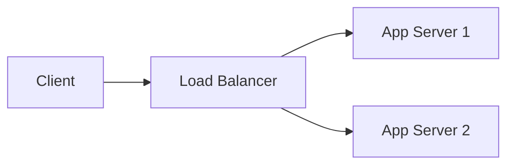

# Simple Load Balancer

```mermaid
flowchart LR
  U[Client] --> LB[Load Balancer]
  LB --> S1[App Server 1]
  LB --> S2[App Server 2]
```

## Demo

https://github.com/user-attachments/assets/02771777-89ab-4e6c-94bd-bf2ed774f6b1

