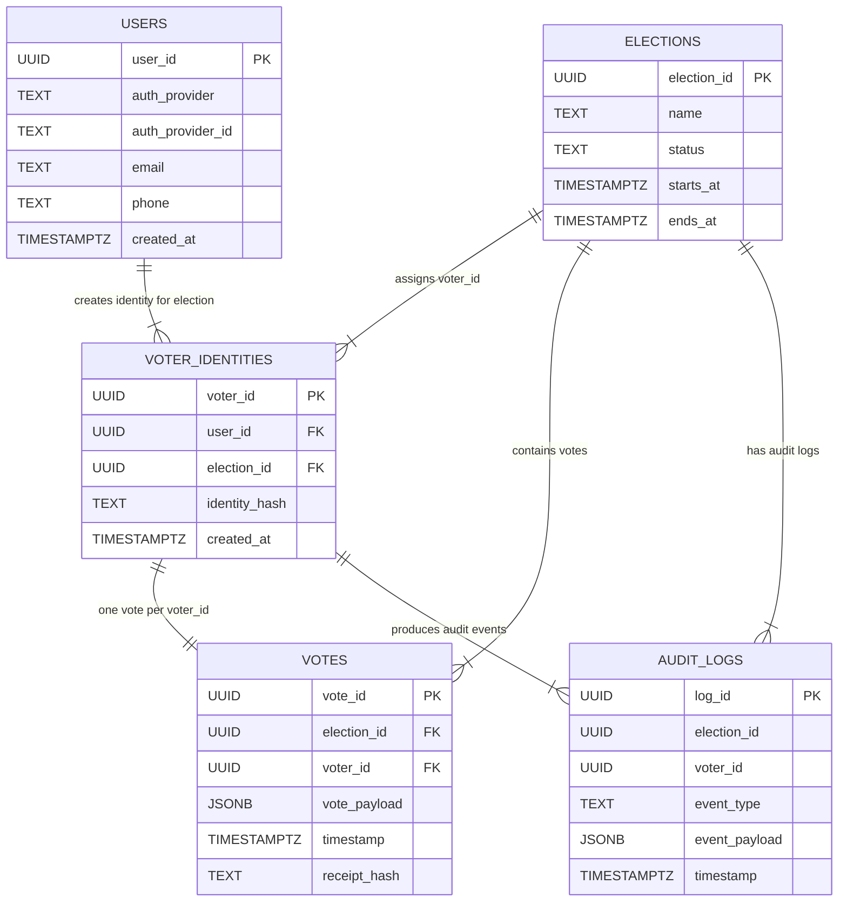
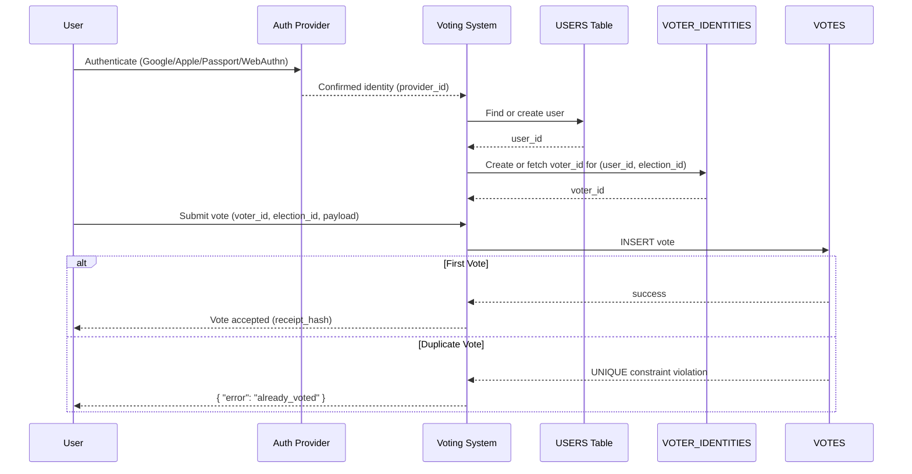

# 🗳️ Database Model (ERD + table descriptions)

## **1. ERD (Entity-Relationship Diagram)**



---

# **2. Tables and Their Roles**

## **USERS**

Represents each real human who authenticated.

```sql
CREATE TABLE users (
  user_id UUID PRIMARY KEY,
  auth_provider TEXT NOT NULL,        -- Google, Apple, gov ID, passport...
  auth_provider_id TEXT NOT NULL,     -- unique per provider
  email TEXT,
  phone TEXT,
  created_at TIMESTAMPTZ DEFAULT NOW(),
  UNIQUE(auth_provider, auth_provider_id) -- ensures only 1 account per real person
);
```

### **Purpose**

- Ensures the platform can identify a unique human.
- Prevents multiple accounts per identity provider.

---

## **ELECTIONS**

Defines each election.

```sql
CREATE TABLE elections (
  election_id UUID PRIMARY KEY,
  name TEXT NOT NULL,
  status TEXT NOT NULL,    -- draft, open, closed
  starts_at TIMESTAMPTZ,
  ends_at TIMESTAMPTZ
);
```

### Purpose

- Organizes votes and voter_ids per election.

---

## **VOTER_IDENTITIES**

Each user receives **one unique voter_id per election**, derived from their verified identity.

```sql
CREATE TABLE voter_identities (
  voter_id UUID PRIMARY KEY,
  user_id UUID REFERENCES users(user_id),
  election_id UUID REFERENCES elections(election_id),
  identity_hash TEXT NOT NULL,          -- can be hashed email, passport, etc.
  created_at TIMESTAMPTZ DEFAULT NOW(),
  UNIQUE (user_id, election_id),        -- ensures user gets only 1 voter_id per election
  UNIQUE (election_id, identity_hash)   -- ensures nobody can impersonate the same person
);
```

### Purpose

- Maps a human identity → a voting identity.
- Prevents one user from generating multiple `voter_id`s.
- Prevents impersonation (same identity_hash cannot register twice).

---

## **VOTES**

Stores the actual votes.
**Critical security constraint: one vote per voter_id.**

```sql
CREATE TABLE votes (
  vote_id UUID PRIMARY KEY,
  election_id UUID REFERENCES elections(election_id),
  voter_id UUID REFERENCES voter_identities(voter_id),
  vote_payload JSONB NOT NULL,    -- can be encrypted or anonymized
  timestamp TIMESTAMPTZ DEFAULT NOW(),
  receipt_hash TEXT UNIQUE,
  UNIQUE (election_id, voter_id)  -- prevents double voting
);
```

### Purpose

- Enforces exactly 1 vote per person per election.
- Stores encrypted payload (so admins cannot see individual votes).

---

## **AUDIT_LOGS**

Append-only logs for forensics and transparency.

```sql
CREATE TABLE audit_logs (
  log_id UUID PRIMARY KEY,
  election_id UUID,
  voter_id UUID,
  event_type TEXT NOT NULL,     -- e.g., "REGISTERED", "VOTED", "ATTEMPT_DOUBLE_VOTE"
  event_payload JSONB,
  timestamp TIMESTAMPTZ DEFAULT NOW()
);
```

### Purpose

- Detect fraudulent attempts.
- Maintain integrity and traceability.
- Provide external auditors with verifiable events.

---

# **3. Interaction Flow Between Tables**

Below is the complete flow:



---

# Summary

### This model guarantees:

### **1. One real person → One user record**

Authentication system prevents duplicate identities.

### **2. One user → One voter_id per election**

Database uniqueness ensures this.

### **3. One voter_id → Only one vote possible**

`UNIQUE(election_id, voter_id)` enforces this at the database level.

### **4. Fraud detection**

All events go to `audit_logs`.
