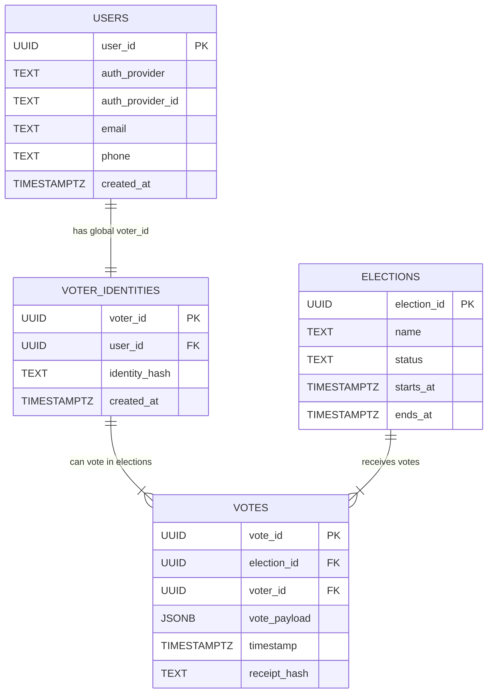
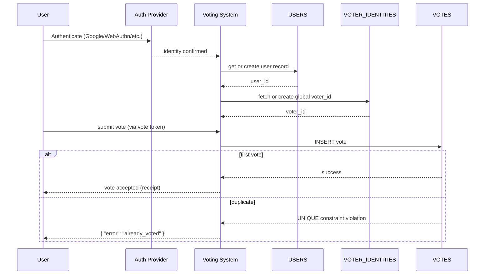

# Ensuring Users Vote Only Once

This document defines a **simple, strict, and consistent model** to ensure that every verified person can cast **exactly one vote per election**, backed by **database-level guarantees**.

---

## Key Principle

Each real user has:

- **One global `voter_id`**, permanent across all elections
- May cast **one vote per election**, enforced by a unique constraint

---

# 1. Identity Model

## Global `voter_id`

Each participant, after verification (email, WebAuthn, passport, gov ID, etc.), receives a **single permanent `voter_id`**.

Characteristics:

- Stable across all elections
- Pseudonymized (e.g., UUID or salted hash of identity)
- Never changes, even if the user votes in many elections
- Not tied to personal data in the voting tables

The real personal information (email, phone) stays only in the **USERS** table.

---

# 2. Tokenized Authorization to Vote

Before voting, the backend issues a **short-lived vote token**, containing:

- `voter_id`
- `election_id`
- expiration timestamp

This prevents API abuse and avoids passing raw voter_id directly.

---

# 3. Database Constraint — The Core Guarantee

At the database level:

```sql
UNIQUE (election_id, voter_id)
```

This **absolutely prevents double-voting**, even under concurrency or race conditions.

A vote insert looks like:

```sql
INSERT INTO votes (election_id, voter_id, vote_payload, receipt_hash)
VALUES ($1, $2, $3, $4);
```

If the user already voted:

- The DB throws an error
- The transaction rolls back
- The backend replies `{ "error": "already_voted" }`

This is the strongest possible guarantee.

---

# 4. Minimal Required Tables

- `users`
- `elections`
- `voter_identities`
- `votes`

# 🗳️ Database Model

## 1. ERD (Updated)



---

# 2. Tables

## USERS

```sql
CREATE TABLE users (
  user_id UUID PRIMARY KEY,
  auth_provider TEXT NOT NULL,        -- Google, Apple, etc.
  auth_provider_id TEXT NOT NULL,     -- unique per provider user
  email TEXT,
  phone TEXT,
  created_at TIMESTAMPTZ DEFAULT NOW(),
  UNIQUE(auth_provider, auth_provider_id)
);
```

---

## VOTER_IDENTITIES

Global, permanent voting identity.

```sql
CREATE TABLE voter_identities (
  voter_id UUID PRIMARY KEY,
  user_id UUID REFERENCES users(user_id),
  identity_hash TEXT NOT NULL,         -- hashed identity (for privacy)
  created_at TIMESTAMPTZ DEFAULT NOW(),
  UNIQUE (identity_hash)               -- ensures no duplicate humans
);
```

---

## ELECTIONS

```sql
CREATE TABLE elections (
  election_id UUID PRIMARY KEY,
  name TEXT NOT NULL,
  status TEXT NOT NULL,        -- draft, open, closed
  starts_at TIMESTAMPTZ,
  ends_at TIMESTAMPTZ
);
```

---

## VOTES

**Critical rule:** one vote per election per voter.

```sql
CREATE TABLE votes (
  vote_id UUID PRIMARY KEY,
  election_id UUID REFERENCES elections(election_id),
  voter_id UUID REFERENCES voter_identities(voter_id),
  vote_payload JSONB NOT NULL,          -- encrypted or anonymized ballot
  timestamp TIMESTAMPTZ DEFAULT NOW(),
  receipt_hash TEXT UNIQUE,
  UNIQUE (election_id, voter_id)
);
```

---

# 3. Interaction Flow



---

# Final Summary

### **1. One real person → One global voter_id**

Permanent for all elections.

### **2. One vote per election**

Enforced by `UNIQUE(election_id, voter_id)`.

### **3. Minimal tables**

Only 4 tables remain.

### **4. Clean privacy boundaries**

Personal data stays only in USERS.
Voting data uses only `voter_id`.

# Data Sharding tradeoffs

# **1. No Sharding (worst)**

**Description:** All votes stored in one table, one database.

**Pros:**

- Extremely simple
- No routing layer
- Easy to manage

**Cons (why it’s the worst):**

- Does NOT scale under heavy write load
- Single point of failure
- Giant table becomes slow
- Not viable for millions of voters

**Best for:**

- Prototypes, tiny apps

---

# **4. Shard by City / Region**

**Description:** Each state/city/region gets its own partition or database.

**Pros:**

- Works if your voting is strongly tied to geography
- Can simplify regional audits

**Cons:**

- Creates **hotspots** (big cities overload their shard)
- Users move → routing complexity
- Rebalancing cities is painful

**Best for:**

- Government-style regional elections
- Not ideal for global/online vote apps

---

# **3. Shard by voter_id Range**

**Description:** You pre-define ranges:

- 0–10M → shard A
- 10M–20M → shard B
- etc.

**Pros:**

- Easy to implement
- Linear scaling
- Predictable routing

**Cons:**

- If voter_id is sequential → hotspot on latest range
- Hard to rebalance ranges later
- Requires random/UUID IDs for even distribution

**Best for:**

- Systems where you control ID generation
- Medium scale

---

# **2. Shard by Consistent Hash (hash(voter_id))**

**Description:** A distributed hash function maps user IDs to shards.

**Pros:**

- Excellent load distribution
- No hotspots
- Easy to add/remove shards with minimal data movement
- Used by high-scale companies (Twitter, Discord, Uber)

**Cons:**

- Requires routing layer
- Slightly more complex than ranges

**Best for:**

- Any large-scale vote system
- Millions of concurrent users

---

# **1. Sharding by Poll/Event + Internal Hash (best)**

**Description:** Partition by **poll_id** first, then distribute inside the poll using hashing or ranges.

Example:

- Poll A → shards 1, 2
- Poll B → shards 3, 4
- Poll C → shard 5

**Pros (why it’s the best):**

- Maximum scalability
- Each vote event grows independently
- Prevents “giant global tables”
- Old events can be archived easily
- Extremely high write throughput

**Cons:**

- Adds complexity in application routing
- Requires a poll-level metadata layer

**Best for:**

- High-volume online voting
- Apps like Instagram polls, YouTube polls, Big Brother voting
- Systems with multiple simultaneous polls

---

# **🏁 Final Ranking: Worst → Best**

| Rank          | Strategy                           | Score |
| ------------- | ---------------------------------- | ----- |
| **5 (worst)** | No Sharding                        | ❌    |
| **4**         | Shard by City                      | ⚠️    |
| **3**         | Shard by Range                     | 👍    |
| **2**         | Shard by Hash (Consistent Hashing) | ⭐    |
| **1 (best)**  | Shard by Poll + Hash               | 🏆    |
