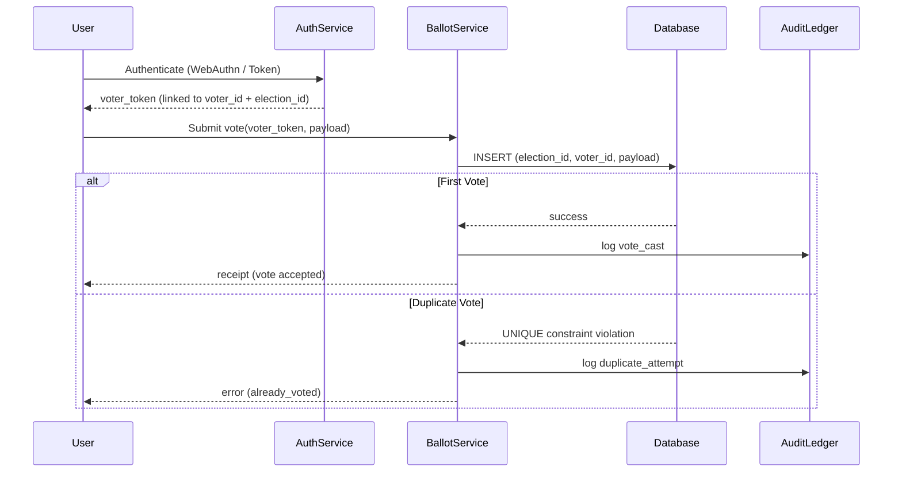

# Ensuring Users Vote Only Once

This document focuses on the **core requirement**: guaranteeing that each verified user can cast **exactly one vote** per election.

---

## Key Principle

Each user (identified by a unique and verified `voter_id`) must be allowed to cast a single valid vote per election. Any additional attempt must be detected and blocked immediately at the database level and logged for audit.

---

## Implementation Strategy

### 1. Unique Voter Identity

- Every participant is assigned a **unique `voter_id`** after verification (email, WebAuthn, or KYC).
- The `voter_id` is globally unique and constant across elections.
- Personal data is not stored directly; instead, a pseudonymized identifier or salted hash is used.

### 2. Tokenized Voting Authorization

- Before voting, the system issues a short-lived **voter token** tied to:

  - The `voter_id`
  - The `election_id`
  - Expiration time (e.g., 5 minutes)

- This token is required to submit a ballot.

### 3. Atomic Insert with Database Constraint

At the database layer, enforce the rule:

```sql
CONSTRAINT unique_vote UNIQUE (election_id, voter_id)
```

Example transaction:

```sql
BEGIN;
INSERT INTO votes (election_id, voter_id, payload, receipt)
VALUES ($1, $2, $3, $4);
COMMIT;
```

If this violates the `UNIQUE` constraint, the system rolls back and returns:

```json
{ "error": "already_voted" }
```

This makes it **impossible** for a user to record multiple votes for the same election, even under race conditions.

### 4. Audit Logging

Every voting attempt (successful or rejected) is appended to an **audit ledger**, including:

- `voter_id_hash`
- `election_id`
- `timestamp`
- `action` (vote_cast, duplicate_attempt)

### 5. Risk & Fraud Monitoring

The system logs duplicate attempts and can trigger further actions:

- Flag for manual review
- Temporarily block the user
- Increase verification requirements (e.g., re-authentication via WebAuthn)

---

## 6. Flow Diagram



## Simple diagram of the idea

[User authenticates]  
        │  
        ▼  
[System generates a unique voter_id]  
        │  
        ▼  
[User submits vote with voter_id]  
        │  
        ▼  
[Database checks: does a vote with (voter_id, election_id) already exist?]  
     ├── No → record vote  
     └── Yes → reject (already_voted)


---

## 7. Summary of Safeguards

| Layer         | Protection Mechanism                       |
| ------------- | ------------------------------------------ |
| Identity      | Unique verified `voter_id`                 |
| Authorization | Time-bound `voter_token`                   |
| Database      | `UNIQUE(election_id, voter_id)` constraint |
| Logic         | Atomic insert + rollback on conflict       |
| Audit         | Append-only logs for traceability          |
| Risk Engine   | Detects duplicate or malicious patterns    |
