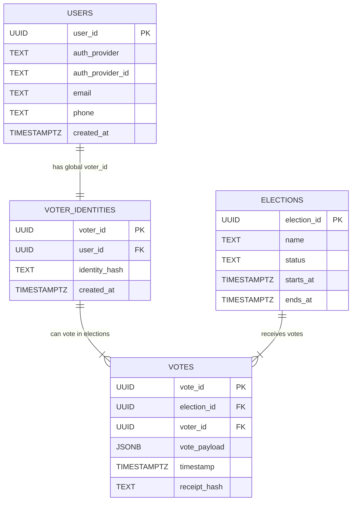
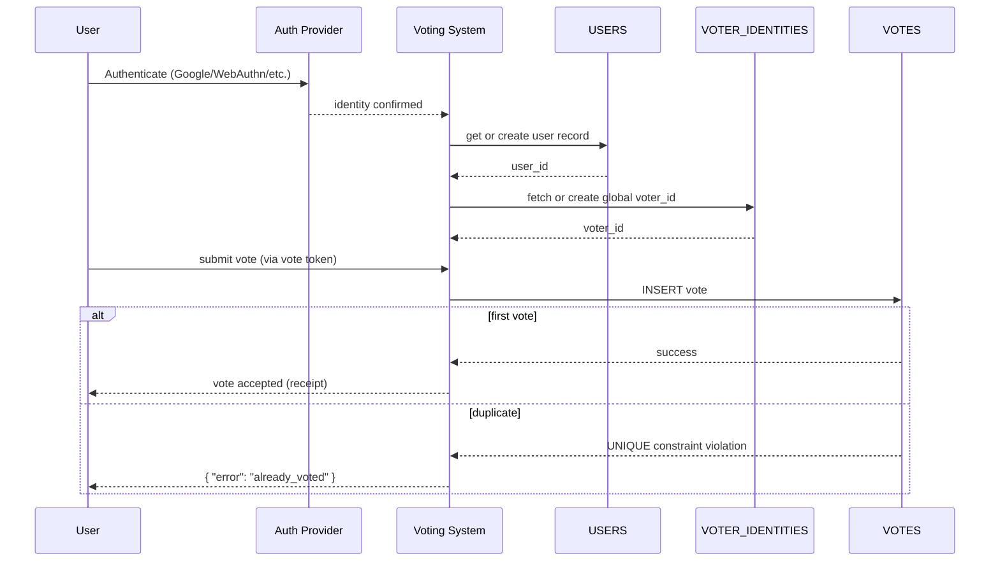

# Ensuring Users Vote Only Once

This document defines a **simple, strict, and consistent model** to ensure that every verified person can cast **exactly one vote per election**, backed by **database-level guarantees**.

---

## Key Principle

Each real user has:

- **One global `voter_id`**, permanent across all elections
- May cast **one vote per election**, enforced by a unique constraint

---

# 1. Identity Model

## Global `voter_id`

Each participant, after verification (email, WebAuthn, passport, gov ID, etc.), receives a **single permanent `voter_id`**.

Characteristics:

- Stable across all elections
- Pseudonymized (e.g., UUID or salted hash of identity)
- Never changes, even if the user votes in many elections
- Not tied to personal data in the voting tables

The real personal information (email, phone) stays only in the **USERS** table.

---

# 2. Tokenized Authorization to Vote

Before voting, the backend issues a **short-lived vote token**, containing:

- `voter_id`
- `election_id`
- expiration timestamp

This prevents API abuse and avoids passing raw voter_id directly.

---

# 3. Database Constraint — The Core Guarantee

At the database level:

```sql
UNIQUE (election_id, voter_id)
```

This **absolutely prevents double-voting**, even under concurrency or race conditions.

A vote insert looks like:

```sql
INSERT INTO votes (election_id, voter_id, vote_payload, receipt_hash)
VALUES ($1, $2, $3, $4);
```

If the user already voted:

- The DB throws an error
- The transaction rolls back
- The backend replies `{ "error": "already_voted" }`

This is the strongest possible guarantee.

---

# 4. Minimal Required Tables

- `users`
- `elections`
- `voter_identities`
- `votes`

---

# 🗳️ Database Model

## 1. ERD (Updated)



---

# 2. Tables

## USERS

```sql
CREATE TABLE users (
  user_id UUID PRIMARY KEY,
  auth_provider TEXT NOT NULL,        -- Google, Apple, etc.
  auth_provider_id TEXT NOT NULL,     -- unique per provider user
  email TEXT,
  phone TEXT,
  created_at TIMESTAMPTZ DEFAULT NOW(),
  UNIQUE(auth_provider, auth_provider_id)
);
```

---

## VOTER_IDENTITIES

Global, permanent voting identity.

```sql
CREATE TABLE voter_identities (
  voter_id UUID PRIMARY KEY,
  user_id UUID REFERENCES users(user_id),
  identity_hash TEXT NOT NULL,         -- hashed identity (for privacy)
  created_at TIMESTAMPTZ DEFAULT NOW(),
  UNIQUE (identity_hash)               -- ensures no duplicate humans
);
```

---

## ELECTIONS

```sql
CREATE TABLE elections (
  election_id UUID PRIMARY KEY,
  name TEXT NOT NULL,
  status TEXT NOT NULL,        -- draft, open, closed
  starts_at TIMESTAMPTZ,
  ends_at TIMESTAMPTZ
);
```

---

## VOTES

**Critical rule:** one vote per election per voter.

```sql
CREATE TABLE votes (
  vote_id UUID PRIMARY KEY,
  election_id UUID REFERENCES elections(election_id),
  voter_id UUID REFERENCES voter_identities(voter_id),
  vote_payload JSONB NOT NULL,          -- encrypted or anonymized ballot
  timestamp TIMESTAMPTZ DEFAULT NOW(),
  receipt_hash TEXT UNIQUE,
  UNIQUE (election_id, voter_id)
);
```

---

# 3. Interaction Flow



# Persistence Model

### **users**

| Name             | Type        | Size     | NOT NULL | Default           | Description         |
| ---------------- | ----------- | -------- | -------- | ----------------- | ------------------- |
| user_id          | uuid        | 16 bytes | YES      | gen_random_uuid() | Primary key         |
| auth_provider    | text        | var      | YES      |                   | e.g., Google, Apple |
| auth_provider_id | text        | var      | YES      |                   | Unique per provider |
| email            | text        | var      | NO       |                   | Optional contact    |
| phone            | text        | var      | NO       |                   | Optional contact    |
| created_at       | timestamptz | 8 bytes  | YES      | now()             | Creation timestamp  |

---

### **voter_identities**

| Name          | Type        | Size     | NOT NULL | Default           | Description                            |
| ------------- | ----------- | -------- | -------- | ----------------- | -------------------------------------- |
| voter_id      | uuid        | 16 bytes | YES      | gen_random_uuid() | Primary key (global voter identity)    |
| user_id       | uuid        | 16 bytes | YES      |                   | FK → users(user_id)                    |
| identity_hash | text        | var      | YES      |                   | Hashed real identity for deduplication |
| created_at    | timestamptz | 8 bytes  | YES      | now()             | Creation timestamp                     |

---

### **elections**

| Name        | Type        | Size     | NOT NULL | Default           | Description           |
| ----------- | ----------- | -------- | -------- | ----------------- | --------------------- |
| election_id | uuid        | 16 bytes | YES      | gen_random_uuid() | Primary key           |
| name        | text        | var      | YES      |                   | Election/display name |
| status      | text        | var      | YES      |                   | draft, open, closed   |
| starts_at   | timestamptz | 8 bytes  | NO       |                   | When voting starts    |
| ends_at     | timestamptz | 8 bytes  | NO       |                   | When voting ends      |

---

### **votes**

| Name         | Type        | Size     | NOT NULL | Default           | Description                                          |
| ------------ | ----------- | -------- | -------- | ----------------- | ---------------------------------------------------- |
| vote_id      | uuid        | 16 bytes | YES      | gen_random_uuid() | Primary key                                          |
| election_id  | uuid        | 16 bytes | YES      |                   | FK → elections(election_id)                          |
| voter_id     | uuid        | 16 bytes | YES      |                   | FK → voter_identities(voter_id)                      |
| vote_payload | jsonb       | var      | YES      |                   | Encrypted/anonymized ballot                          |
| timestamp    | timestamptz | 8 bytes  | YES      | now()             | Vote submission time                                 |
| receipt_hash | text        | var      | YES      |                   | Unique vote receipt                                  |
| —            | UNIQUE      | —        | —        | —                 | (election_id, voter_id) enforces one vote per person |

# Final Summary

### **1. One real person → One global voter_id**

Permanent for all elections.

### **2. One vote per election**

Enforced by `UNIQUE(election_id, voter_id)`.

### **3. Minimal tables**

Only 4 tables remain.

### **4. Clean privacy boundaries**

Personal data stays only in USERS.
Voting data uses only `voter_id`.

---

# Data Sharding tradeoffs

# **1. No Sharding**

**Description:** All votes stored in one table, one database.

PROS (+)

- scalability: simple single-node or single logical DB, zero routing complexity.
- operational: trivial to implement, easy backups and transactional guarantees.
- development speed: fastest to build and iterate.

CONS (-)

- consistency: + (strong): single DB gives strong transactional consistency and constraints work globally.
- scalability: - (bad): will not scale to millions of votes or very high write throughput; single point of scale.
- availability/cost: - (risk/cost): to scale, you must vertically scale the instance (expensive) and risk single point of failure.
- latency for global users: -: global users distant from DB may see higher latency (unless fronted by edge).
- operations: -: huge table growth causes maintenance (vacuum, index bloat, slower backups).

**Best for:**

- Prototypes, tiny apps

---

# **4. Shard by City / Region**

**Description:** Each state/city/region gets its own partition or database.

PROS (+)

- locality: +: good for geo-bound elections (regional laws, audits).
- latency: +: users in-region have lower latencies if shard is local.
- auditability: +: regional audits simplified because data is local.

CONS (-)

- consistency: -: cross-region global constraints (one vote per user across regions) require coordination or global index — complex to guarantee.
- hotspots: -: large cities create imbalanced load (hot shard).
- rebalancing: -: moving cities between shards is operationally painful and error-prone.
- cost: -: several regional DBs increases overhead (ops + backups + monitoring).
- user mobility: -: users who move or vote in different regions require routing / identity resolution complexity.

**Best for:**

- Government-style regional elections
- Not ideal for global/online vote apps

---

# **3. Shard by voter_id Range**

**Description:** You pre-define ranges:

- 0–10M → shard A
- 10M–20M → shard B
- etc.

PROS (+)

- routing simplicity: +: range routing is deterministic and easy to implement.
- predictable scaling: +: you can add new ranges as load grows.
- local transactional guarantees: +: each shard enforces uniqueness for its range.

CONS (-)

- consistency: -: if `voter_id` generation not uniform, hotspots on recent ranges may appear; uniqueness is per-shard so cross-shard uniqueness must be designed.
- rebalancing: -: splitting/merging ranges requires moving large volumes of data (costly).
- skew: -: temporal allocation (sequential IDs) can bias load to newer shards.
- operational complexity: -: requires mapping service and migrations for rebalancing.

**Best for:**

- Systems where you control ID generation
- Medium scale

---

# **2. Shard by Consistent Hash (hash(voter_id))**

**Description:** A distributed hash function maps user IDs to shards.

PROS (+)

- load distribution: +: excellent: uniform distribution reduces hotspots.
- scalability: +: easy to add/remove shards with minimal remapping (via consistent hashing ring).
- simplicity for ownership: +: each voter_id always maps to same shard (deterministic).

CONS (-)

- consistency: -: uniqueness of (election_id, voter_id) is local to a shard — good — but cross-shard aggregation needs coordination.
- routing complexity: -: requires routing layer / service discovery to find the correct shard for writes.
- cost: -: more shards → more DB instances and ops overhead.
- cross-election operations: -: cross-shard queries (global tallies) need scatter-gather and are slower/complex.
- recovery/rebalancing: -: adding a shard requires moving keys; consistent hashing reduces but does not eliminate data movement.

**Best for:**

- Any large-scale vote system
- Millions of concurrent users

---

# **1. Sharding by Poll/Event + Internal Hash (best)**

**Description:** Partition by **poll_id** first, then distribute inside the poll using hashing or ranges.

Example:

- Poll A → shards 1, 2
- Poll B → shards 3, 4
- Poll C → shard 5

PROS (+)

- scalability: +: **best** for high-volume events — each poll is isolated and can scale independently.
- consistency: +: uniqueness (election_id, voter_id) is enforced inside poll partitions/shards; easy to reason about.
- operational: +: old polls can be archived per-poll; reindex/maintenance per-poll less risky.
- performance: +: per-poll shards keep working set small and reduce contention; simplifies horizontal scale for hot polls.
- auditability: +: easy to export/verify a single poll as a unit.

CONS (-)

- application routing: -: must route writes to the shard that hosts that poll; requires poll-metadata service (poll -> shard map).
- complexity: -: more moving parts (shard manager, placement strategy, monitoring).
- cost: -: many polls means many shards/partitions to manage (but you can collocate small polls).
- cross-poll analytics: -: global analytics/tallies are scatter-gather and can be slower; needs aggregation pipelines (CDC + data warehouse).
- transactional coordination: -: operations that must touch multiple polls will need cross-shard coordination (rare for voting apps).

**Best for:**

- High-volume online voting
- Apps like Instagram polls, YouTube polls, Big Brother voting
- Systems with multiple simultaneous polls

---

# **🏁 Final Ranking: Worst → Best**

| Rank          | Strategy                           | Score |
| ------------- | ---------------------------------- | ----- |
| **5 (worst)** | No Sharding                        | ❌    |
| **4**         | Shard by City                      | ⚠️    |
| **3**         | Shard by Range                     | 👍    |
| **2**         | Shard by Hash (Consistent Hashing) | ⭐    |
| **1 (best)**  | Shard by Poll + Hash               | 🏆    |
